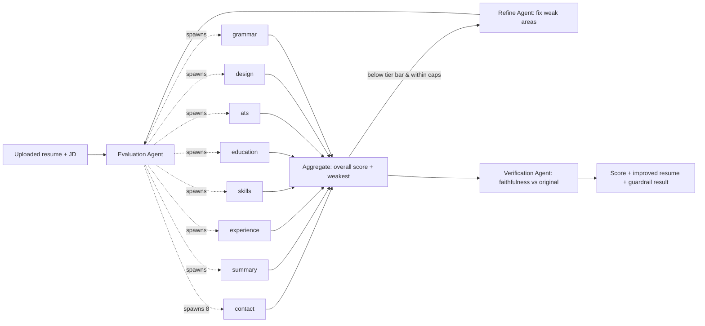
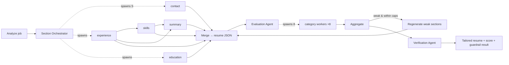

# Agent Graph Engine — Architecture, Data Flow, Caching

> The single-model **graph + loop** engine behind CV Score and CV Build.
> Code: `backend/services/graph/` + `backend/services/llm/gateway.py`.
> Last updated: 2026-08-16.

The app runs each AI feature as a **graph of agent-nodes** driven by **refinement
loops** — not a linear workflow. Independent agents run concurrently (`asyncio`);
a dependent agent connects to another **only when it needs that agent's output**;
those dependencies are the arrows in the live graph (`/graph` in the app; admin
runs viewer). One provider, one config-driven model (`gateway.active_model()`).

---

## The four phases (both features share them)

**Generate → Review → Update → Loop / Exit**, then a **Verification** guardrail.

| Phase | Who | What |
|---|---|---|
| Generate | Section workers (Build only; Score starts from the uploaded resume) | Write each resume section in parallel |
| Review | **Evaluation Agent** → category workers | Score every quality category in parallel, then aggregate |
| Update | Section workers (Build) / **Refine Agent** (Score) | Rewrite only the weak parts — never fabricates |
| Loop / Exit | **LoopController** (tier rules) | Re-review; keep the best; stop on quality / cycles / cost |
| Guardrail | **Verification Agent** | Audit the result vs the original for fabrication |

---

## Agent hierarchy — who spawns whom, and how many

Orchestrator **agents** dynamically spawn **workers** (sub-agents). Counts are
dynamic (they depend on the resume/template); every run records `spawned_count`
on the orchestrator and shows it in the graph.

| Orchestrator agent | Spawns | Count |
|---|---|---|
| **Section Orchestrator** (Build) | Section workers | = sections in the resume/template (default **5**) |
| **Evaluation Agent** (both) | Category workers | = quality categories (**8**) |
| **Refine Agent** (Score) / weak Section workers (Build) | — | 1 per refine cycle / 1 per weak section |
| **Verification Agent** (both) | — | 1 per run |

**Total LLM sub-agents per run** (dynamic):

- **CV Score** = `8` (first review) `+ Σ cycles (1 refine + 8 review)` `+ 1` (verification, only if the resume changed).
- **CV Build** = `S` sections `+ 8` (review) `+ Σ cycles (W weak sections + 8 review)` `+ 1` (verification), where `S`≈5, `W`=weak sections that cycle.

Concurrency is bounded by `settings.graph_concurrency` (default 5) so the many
blocking LLM calls don't trip the provider rate limit.

---

## CV Score — data flow



**Data moved:** the resume+JD corpus → each category worker (cached, see below);
each worker returns `{score, status, checks, improvements}`; the aggregate blends
them (weighted, renormalised) into an overall score + the weakest categories,
which the Refine Agent consumes to rewrite only those areas.

## CV Build — data flow



**Data moved:** the candidate corpus (resume+profile+JD+skills) → every section
worker (cached); each returns its section JSON; `Merge` assembles the resume JSON;
the Evaluation Agent scores it; weak categories map to weak sections that get
regenerated. Section **dependencies** (skills→experience, summary→experience+
skills) are real edges — a dependent section receives its predecessors' output.

---

## Caching — KV / prompt cache (the cost lever)

We use provider-side **prompt caching** (the KV cache of the shared prefix). Every
call is shaped by `gateway.complete(system, cached_context, task)`:

```
[ system  (cached) ][ cached_context = resume+JD+profile corpus (cached) ][ task (NOT cached) ]
        └──────────────── byte-identical across every sub-agent ───────────────┘
```

- The **shared corpus is byte-identical** across all fan-out sub-agents in a run
  and carries an Anthropic `cache_control: ephemeral` breakpoint (forwarded by
  OpenRouter) — the per-agent rubric/instruction is the only fresh input.
- **Where the cache pays off:** *sequential* reuse — the refine loop's re-review
  reads the cache the first review wrote, and CV Build's review reads across the
  merge→review handoff. Verified live (`scripts/spike_openrouter_cache.py`): a
  second call read **7,428 tokens from cache**, ~88% cheaper.
- **Where it does not:** a *single* parallel fan-out burst. Because the 8 workers
  fire concurrently, none can read a cache entry the others are still writing (a
  cache entry is only readable after the first response starts streaming), so the
  first review pass pays full input price on all 8. This is the parallelism ↔
  caching trade-off; we keep parallelism for latency and take the cache win on
  the loop/handoff passes.
- Usage is read straight off the response (`cache_read_tokens` etc.) and rolled
  into every node's cost and the run totals — visible in the graph.
- Cache minimum for Sonnet is ~2048 tokens; the corpus clears it. `:free` dev
  models may not cache (harmless) — dev runs cost nothing anyway.

Implementation: `backend/services/llm/gateway.py` (`_cache_block`, `_parse_usage`).
**Not yet wired:** run-level result caching (dedup by `GraphRun.input_hash`) — the
field exists; wiring it would let identical inputs skip the whole run.

---

## Loop exit rules — tier-based, admin-managed

The generator↔evaluator loop can cycle forever, so `LoopController`
(`services/graph/loop.py`) exits on **three tier-based rules**, all editable in
the admin dashboard (Tiers & Pricing → limits) and resolved by
`services/graph/tier_rules.loop_controller_for(tier)`:

| Rule | Tier limit key | Meaning |
|---|---|---|
| Exit quality | `pass_threshold` | stop once the score meets the bar |
| Cycle cap | `max_eval_cycles` | hard cap on refine cycles |
| Cost cap | `max_run_cost_cents` | stop once estimated run spend hits this |

Plus a cost-efficiency **plateau** early-exit (a cycle that doesn't improve stops
the loop; we always keep the best result).

---

## Prompts — in MongoDB, admin-editable

All agent prompts default in `services/graph/prompts.py` and are **overridable in
MongoDB** (`prompt_overrides`), edited in **Admin → Agent Graph Prompts**. Each
agent resolves its prompt at run time (override → code default). The
machine-readable JSON schema stays in code so an edit can't break the output
contract.

| Key(s) | Agent |
|---|---|
| `graph_category_system` + `graph_category_{contact,summary,experience,skills,education,ats,design,grammar}` | Category reviewers (Review) |
| `graph_section_system` + `graph_section_{contact,experience,education,skills,summary}` | Section writers (Generate) |
| `graph_refine_system` | Refine Agent (Update) |
| `graph_verification_system` + `graph_verification_task` | Verification Agent (Guardrail) |

---

## Guardrail — how one model still does "multiple checks"

The old design used 3 models for cross-model consensus. The single-model engine
replaces that with three same-model layers:

1. **Decomposition** — 8 focused category workers (a focused check is more
   reliable than one holistic call).
2. **Deterministic validators** (`validators.py`) — model-independent structural
   guardrails (schema, score clamping, no structural fabrication).
3. **Verification Agent** — a distinct role + prompt that re-audits the output for
   fabrication vs the original; its faithfulness result is recorded on the run.

---

## Endpoints (Swagger `/docs`) — inspect what's stored

| Endpoint | Inspects |
|---|---|
| `POST /api/graph/cv-score`, `POST /api/graph/cv-build` | start a run |
| `GET /api/graph/runs/{id}` | full `GraphRun` (nodes, edges, loops, costs, evals) — polling + the visualization |
| `GET /api/graph/runs` | recent runs (superadmin) — `graph_runs` collection |
| `GET /api/admin/prompts` | all prompts incl. graph (category `graph`) + overrides |
| `GET /api/config/tiers` | tier config incl. the loop exit rules |

Config: `PRIMARY_MODEL` (paid, test/prod) vs `DEV_MODEL` (free) selected by
`GRAPH_DEV_MODE`; `OPENROUTER_API_KEY`; `graph_concurrency`.
